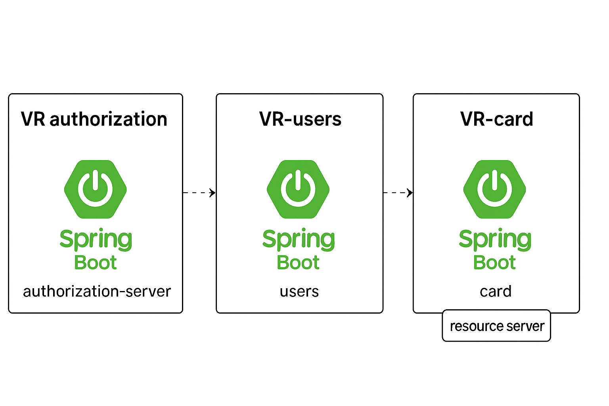

# Bem vindo ao repositório do desafio técnico "mini-autorizador"

fazendo a leitura do enunciado, percebi que se trata de uma arquiterura orientada à micro-serviços. Como a proposta deixa bastante claro o que fazer, também  deixa livre para a tomada e decisão em relação  à como fazer. 

Sendo assim tomei a liberdade de criar três micro serviços utilizando Spring boot na sua versão 3.1.6 e java 17 

Os serviços de authorization e users se comunicam para fornecer o tokenJWT, decisão tomada para atuhenticação/autorização, pois na minha visão fica mais aderente à arquitetura em micro serviços.
O serviço de Card desempenha o papel do resource Server nesse contexto
